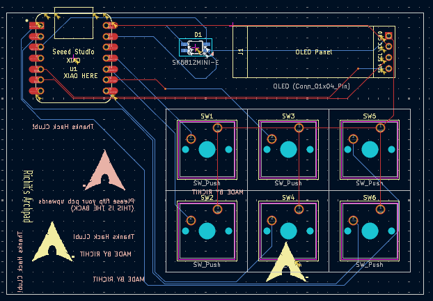
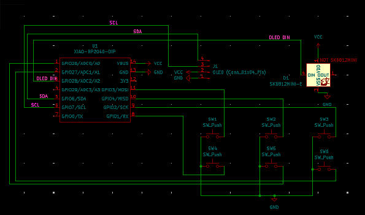
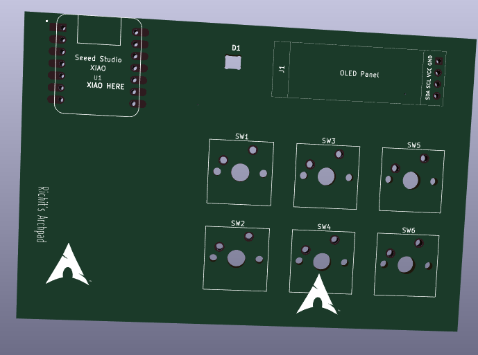
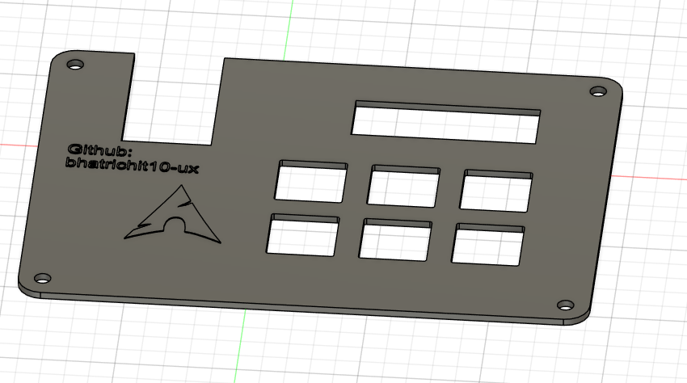
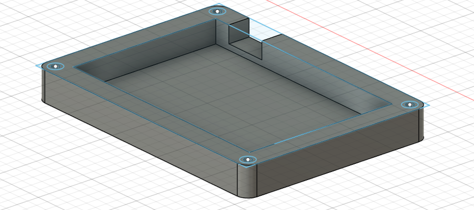

# Archpad
A custom-made macropad/hackpad for arch users.  Made for blueprint by Hack Club

## PCB (Printed Circuit Board)
The files of PCBs is inside the PCB folder, It contains a KiCad Project, a schematic file and a pcb file.  
[PCB file](PCB/richit.kicad_pcb)  
[Project File](PCB/richit.kicad_pro)  
[Schematic Files](PCB/richit.kicad_sch)
### Images:

## Case (CAD)

### Files: 
[Stp_TOP](production/Archpad_top.stp)  
[Stp_Bottom_Case](production/Archpad_Latest.stp)
## Firmware
The firmware is coded in KMK which is in python. 
I have taken help of ChatGPT in this part  
[Main.py](firmware/KMK/main.py)
## BOM
- Seeed XIAO RP2040 ×1
- MX-style mechanical switches ×6
- Blank DSA keycaps (white) ×6
- 0.91 inch OLED display (SSD1306, I2C) ×1
- SK6812 MINI-E RGB LED ×1
- M3 × 16 mm screws ×4
- M3 heat-set inserts ×4
- 3D printed case ×1
## Thanks HackClub
Special thanks to HackClub and Blueprint for providing this opportunity. 
Join them : [HackClub](https://hackclub.com)
Blueprint : [Blueprint](https://blueprint.hackclub.com)
## Whats next?
I am working on making another cool projects like this